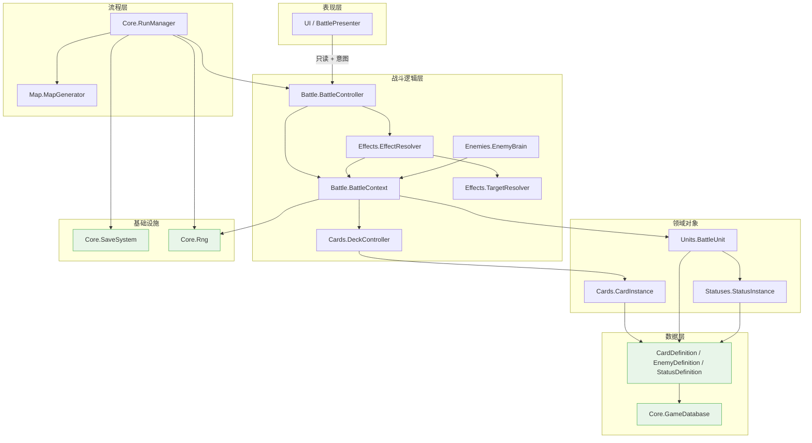
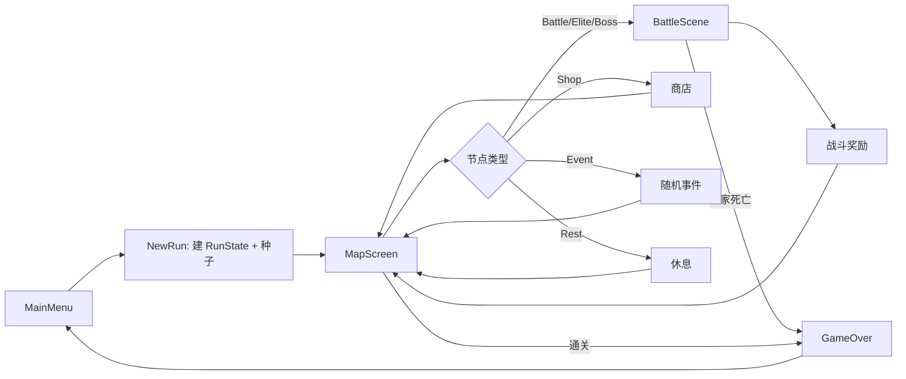
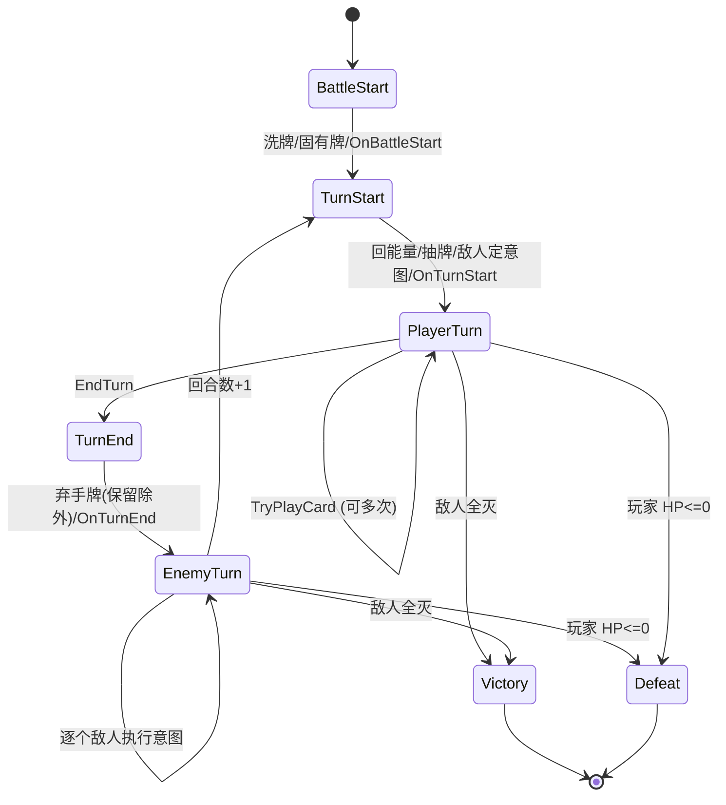
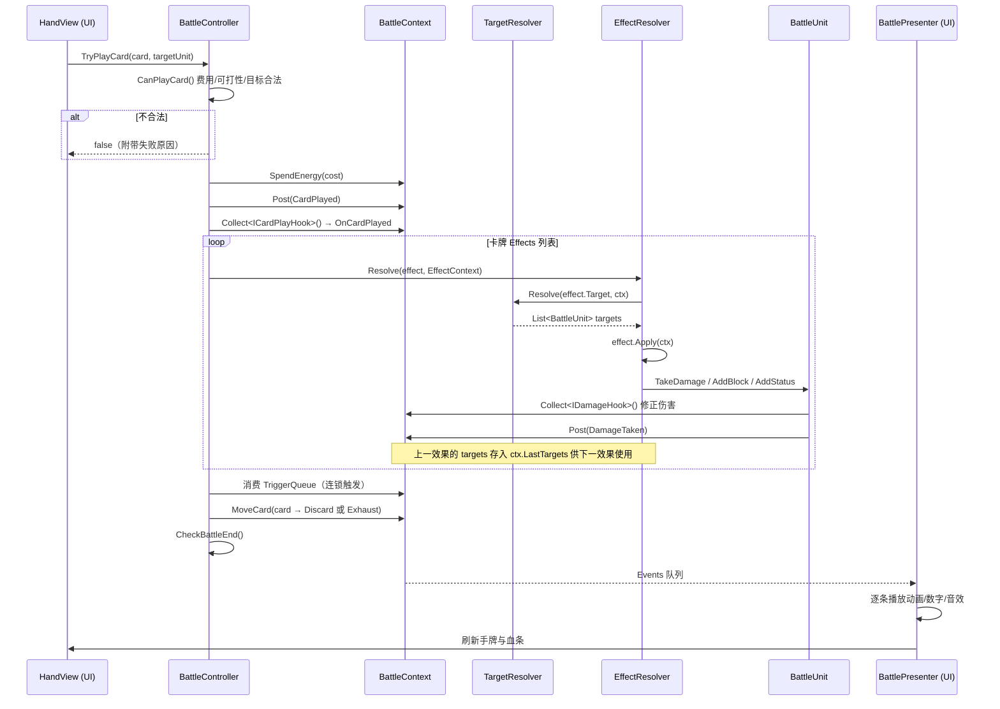

# 第二部分：推荐架构总览

## 2.1 架构原则（十条，全部可验证）

| # | 原则 | 可验证标准 |
|---|---|---|
| 1 | **Definition / Instance 二分** | 任何 ScriptableObject 里不得出现在战斗中会被写入的字段。SO 全部只读。 |
| 2 | **逻辑同步、表现异步** | `BattleController` 及以下不出现 `IEnumerator`、不出现 `Time.deltaTime`、不引用 `UnityEngine.UI`。 |
| 3 | **上下文对象取代单例** | 全项目只允许 2 个单例：`GameApp`、`GameDatabase`。其余系统通过 `BattleContext` / `RunContext` 传递。 |
| 4 | **效果数据化优先** | 90% 的卡不需要写任何 C#，只在 Inspector 里配效果列表。 |
| 5 | **继承不超过 2 层** | `CardEffect` → 具体效果，到此为止。没有第三层。 |
| 6 | **拉取式 Hook** | 状态/遗物/卡牌的被动不注册监听，由 `BattleContext.Collect<T>()` 现场收集。 |
| 7 | **触发排队不递归** | 所有连锁触发进 `BattleContext.TriggerQueue`，由一个循环消费。 |
| 8 | **UI 只读逻辑、只发意图** | UI 层只能调用 `BattleController.TryPlayCard/EndTurn` 三五个方法，禁止直接改 `BattleUnit.Hp`。 |
| 9 | **随机分流** | 所有随机走 `ctx.Rng(RngStream.X)`，禁止 `UnityEngine.Random`。 |
| 10 | **可无 UI 运行** | 战斗系统必须能在纯 EditMode 单元测试里跑完一整场。 |

原则 2 和 10 是最重要的两条。参考项目最大的问题就是逻辑和协程/UI 焊死，导致无法测试、无法做「出牌预览」、无法做自动模拟平衡性。

## 2.2 模块划分

| 模块 | 职责 | 主要类数 |
|---|---|---|
| **Core** | 应用入口、数据库、随机、存档、局外流程状态机 | 7 |
| **Cards** | 卡牌定义与实例、牌堆 | 4 |
| **Effects** | 效果基类、上下文、数值、目标选择、结算器 | 6 |
| **Units** | 战斗单位、属性 | 2 |
| **Statuses** | 状态定义/实例/行为 | 3 |
| **Enemies** | 敌人定义、行动、意图、AI | 4 |
| **Battle** | 战斗状态机、上下文、事件 | 5 |
| **Map** | 地图生成、节点 | 2 |
| **UI** | 表现层 | 不限 |

核心 31 个类（不含 UI / 具体效果实现 / 工具）。

## 2.3 模块依赖图



**箭头方向即依赖方向，无环。** 关键约束：
- 没有任何一条箭头从「战斗逻辑层」指向「表现层」。战斗只往 `BattleContext.Events` 队列里丢事件，UI 自己来取。
- `EffectResolver` 不认识 `BattleController`，只认识 `BattleContext`。这样效果也能被遗物、状态、敌人行动复用。

## 2.4 核心运行流程



`RunManager` 是这张图的唯一执行者，是一个**显式 switch 状态机**，不用任何状态机框架。

## 2.5 战斗状态流转图



`BattlePhase` 枚举 = `BattleStart, TurnStart, PlayerTurn, TurnEnd, EnemyTurn, Victory, Defeat`。

**每次相位切换都在 `BattleController.Advance()` 一个方法里完成**，一眼看得完。

## 2.6 出牌结算时序图



## 2.7 数据流

```
ScriptableObject (CardDefinition)  ── 只读，游戏一生不变
        │ new CardInstance(def)
        ▼
CardInstance  ── 每局唯一，可升级、可临时改费、可被复制
        │ 存档时序列化成 CardSaveEntry { defId, upgradeLevel }
        ▼
RunSave (JSON)  ── 局内存档
```

```
CardDefinition.Effects : List<CardEffect>   ← [SerializeReference] 多态，随 SO 一起序列化
        │  ★ 只读！不允许在 Apply 里写自己的字段
        ▼
EffectResolver.Resolve(effect, ctx)
        │  一切可变数据都在 ctx / ctx.Battle 里
        ▼
BattleContext（唯一的战斗可变状态容器）
```

## 2.8 事件流（两套，必须分清）

| | **Hook（逻辑）** | **Event（表现）** |
|---|---|---|
| 目的 | 改变结算结果 | 播动画/音效/飘字 |
| 机制 | `ctx.Collect<T>()` 现场拉取接口实现者 | `ctx.Post(new BattleEvent(...))` 入队 |
| 时机 | 同步、立即、可修改 ref 参数 | 异步、战斗结束前由 UI 消费 |
| 谁实现 | `StatusBehaviour`、`RelicBehaviour`、`CardInstance` | 无人实现，纯数据 |
| 举例 | 力量加伤、易伤增伤、荆棘反伤 | 「造成 12 点伤害」的飘字 |
| 顺序 | 由 `HookOrder` 显式排序 | 入队顺序 |

**为什么必须分开**：参考项目把两者混在一起（Chrono Ark 的 `IP_*` 里既有 `IP_DamageChange` 改数值也有 `IP_ParticleOut_Before` 放特效），结果逻辑无法脱离表现运行。

Hook 接口只有 **8 个**（对比 Chrono Ark 的 55 个）：

```
ITurnHook          OnTurnStart / OnTurnEnd
ICardPlayHook      OnCardPlayed / OnCardDrawn / OnCardDiscarded
IDamageHook        ModifyOutgoingDamage / ModifyIncomingDamage / OnDamaged
IHealHook          ModifyHeal
IBlockHook         ModifyBlock / OnBlockExpire
IDeathHook         OnUnitDied
IBattleHook        OnBattleStart / OnBattleEnd
IEnergyHook        ModifyEnergyGain
```

每个接口 2~3 个方法，`StatusBehaviour` 想响应哪个就实现哪个。这是 Chrono Ark `IP_*` 的**压缩版**：把 55 个单方法接口合并成 8 个多方法接口，派发次数从 55 降到 8。

---

# 第三部分：目录结构

```
Assets/
├── Game/
│   ├── Core/                     # 应用骨架，不含玩法
│   │   ├── GameApp.cs            # 唯一常驻单例：持有 RunContext + Database，场景切换
│   │   ├── GameDatabase.cs       # SO：按 id 索引所有 Definition
│   │   ├── Rng.cs                # 可序列化的确定性随机 + RngStream 枚举
│   │   ├── RunContext.cs         # 一局游戏的全部可变数据（局外）
│   │   ├── RunManager.cs         # 局外流程状态机（地图/商店/事件/奖励）
│   │   ├── SaveSystem.cs         # 静态：RunSave / MetaSave 的 JSON 读写与版本迁移
│   │   └── Ids.cs                # 全局常量 id（状态 id、卡 id 前缀等）
│   │
│   ├── Cards/                    # 卡牌本体与牌堆
│   │   ├── CardDefinition.cs     # SO：一张卡的静态配置
│   │   ├── CardInstance.cs       # 运行时卡牌对象（可克隆、可升级、可临时改费）
│   │   ├── CardEnums.cs          # CardType / CardRarity / CardTargetKind / CardKeyword
│   │   └── DeckController.cs     # 抽牌堆/手牌/弃牌堆/消耗堆 + 抽洗弃消
│   │
│   ├── Effects/                  # 效果系统（本架构的心脏）
│   │   ├── CardEffect.cs         # [Serializable] abstract 基类
│   │   ├── EffectContext.cs      # 一次结算的上下文
│   │   ├── EffectValue.cs        # 可缩放数值（固定值 / 按状态层数 / 按护甲 / 按手牌数…）
│   │   ├── EffectCondition.cs    # 可序列化条件
│   │   ├── TargetSelector.cs     # 目标选择配置 + TargetResolver 静态解析
│   │   ├── EffectResolver.cs     # 效果结算入口（含递归深度保护）
│   │   └── Impl/                 # 具体效果实现（每个文件 20~60 行）
│   │       ├── DamageEffect.cs
│   │       ├── BlockEffect.cs
│   │       ├── DrawEffect.cs
│   │       ├── EnergyEffect.cs
│   │       ├── ApplyStatusEffect.cs
│   │       ├── HealEffect.cs
│   │       ├── DiscardEffect.cs
│   │       ├── ExhaustEffect.cs
│   │       ├── AddCardEffect.cs
│   │       ├── ModifyCardCostEffect.cs
│   │       ├── RepeatEffect.cs         # 组合子：重复 N 次
│   │       ├── ConditionalEffect.cs    # 组合子：if / else
│   │       ├── RandomPickEffect.cs     # 组合子：随机挑一个子效果
│   │       └── DelayedEffect.cs        # 组合子：延迟到回合末/下回合
│   │
│   ├── Units/
│   │   ├── BattleUnit.cs         # 玩家和敌人统一的战斗单位
│   │   └── UnitStats.cs          # HP/Block/基础属性 struct
│   │
│   ├── Statuses/
│   │   ├── StatusDefinition.cs   # SO：图标、名字、堆叠规则、行为列表
│   │   ├── StatusInstance.cs     # 运行时：层数、剩余回合、来源
│   │   └── StatusBehaviour.cs    # [Serializable] abstract + Impl/ 目录下具体行为
│   │       └── Impl/ StrengthBehaviour / VulnerableBehaviour / PoisonBehaviour / ...
│   │
│   ├── Enemies/
│   │   ├── EnemyDefinition.cs    # SO：血量、行动列表、AI 类型
│   │   ├── EnemyAction.cs        # [Serializable]：意图类型 + 效果列表 + 权重 + 条件
│   │   ├── EnemyBrain.cs         # 从行动列表选下一个行动（数据驱动 + 可继承）
│   │   └── Intent.cs             # struct：给 UI 看的意图快照
│   │
│   ├── Battle/
│   │   ├── BattleController.cs   # 战斗状态机 + 对外 API（TryPlayCard/EndTurn）
│   │   ├── BattleContext.cs      # 战斗全部可变状态 + Hook 收集 + 事件队列
│   │   ├── BattleEnums.cs        # BattlePhase / BattleEventType / HookOrder
│   │   ├── BattleEvent.cs        # struct：表现层事件
│   │   └── BattleHooks.cs        # 8 个 Hook 接口定义
│   │
│   ├── Map/
│   │   ├── MapNode.cs            # 节点数据（类型、坐标、连边）
│   │   └── MapGenerator.cs       # 用 RngStream.Map 生成地图
│   │
│   ├── Save/
│   │   ├── RunSave.cs            # 局内存档 DTO
│   │   └── MetaSave.cs           # 永久解锁 DTO
│   │
│   └── UI/
│       ├── Battle/               # BattleScreen / HandView / CardView / UnitView /
│       │                         # IntentView / StatusIconView / DamagePopup / BattleLogView
│       ├── Map/                  # MapScreen / MapNodeView
│       ├── Reward/               # RewardScreen / CardRewardView
│       ├── Shop/                 # ShopScreen
│       ├── Common/               # TooltipSystem / ScreenFader / SfxPlayer
│       └── BattlePresenter.cs    # ★ 唯一消费 BattleContext.Events 的类
│
├── GameData/                     # 所有 ScriptableObject 资产（不含代码）
│   ├── Cards/
│   ├── Enemies/
│   ├── Statuses/
│   ├── Relics/
│   ├── Encounters/
│   └── GameDatabase.asset
│
├── Art/  Audio/  Scenes/  Settings/
└── Tests/
    └── EditMode/                 # 纯逻辑测试：整场战斗不开 UI 跑通
```

## 3.1 各目录职责与红线

| 目录 | 职责 | 红线（违反即架构腐化） |
|---|---|---|
| `Core` | 应用生命周期、数据索引、随机、存档 | 不得引用 `Battle`/`Cards` 的具体逻辑；只能持有它们 |
| `Cards` | 卡牌数据结构与牌堆操作 | `CardInstance` 不得引用 UI；`DeckController` 不得直接改单位属性 |
| `Effects` | 一切「做了什么」 | 效果类不得有可变字段；不得 `using UnityEngine.UI` |
| `Units` | 单位状态容器 | 不得包含 AI 决策；不得直接播动画 |
| `Statuses` | 状态数据与行为 | `StatusDefinition` 不得存层数 |
| `Enemies` | 敌人配置与决策 | `EnemyBrain` 只做「选哪个行动」，执行交给 `EffectResolver` |
| `Battle` | 流程编排 | 不得出现 `IEnumerator`、`Update()`、`Time.deltaTime` |
| `Map` | 地图生成 | 不得引用 `Battle` |
| `UI` | 表现 | **只能读 `BattleContext`，只能调 `BattleController` 的公开意图方法** |
| `GameData` | 资产 | 不放任何 `.cs` |

## 3.2 程序集划分（可选但推荐）

建两个 asmdef：
- `Game.Runtime`（`Assets/Game/` 除 UI 外）
- `Game.UI`（依赖 `Game.Runtime`）
- `Game.Tests.EditMode`（依赖 `Game.Runtime`，**不依赖 `Game.UI`**）

这样「UI 不许被逻辑引用」由编译器强制执行，而不是靠自觉。这是防止架构腐化最省力的手段。
