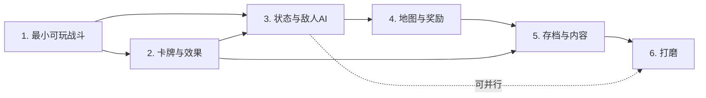

# 第八部分：开发路线图

每个阶段都以「能跑起来的东西」为终点，不做纯基础设施阶段。

---

## 第 1 阶段：最小可玩战斗（约 1～2 周）

**目标**：一个场景里，玩家用 3 张打击 1 张防御打死一只史莱姆。全程无美术，用 UGUI 方块 + 文字。

**要实现的功能**
- 能量、抽牌、手牌、弃牌堆、洗牌
- 点击出牌（先不做拖拽）、单目标选择
- 伤害、护甲
- 敌人固定序列行动、意图文字显示
- 胜负判定

**新增的类**
```
Core/       Rng, GameDatabase, RunContext, EncounterDefinition
Cards/      CardEnums, CardDefinition, CardInstance, DeckController
Effects/    CardEffect, EffectContext, EffectValue, TargetSelector, TargetResolver, EffectResolver
            Impl/ DamageEffect, BlockEffect
Units/      BattleUnit
Statuses/   StatusDefinition, StatusInstance, StatusBehaviour   （先建好，行为留空）
Enemies/    EnemyDefinition, EnemyAction, EnemyBrain, Intent
Battle/     BattleEnums, BattleEvent, BattleHooks, BattleContext, BattleController
UI/         BattleScreen, HandView, CardView, UnitView, IntentView, BattlePresenter
```
共 **24 个类**。

**验收标准**
1. EditMode 测试 `PlayStrike_DealsSixDamage` 通过。
2. 场景里能打完一整场并显示「胜利」。
3. `BattleController.cs` 全文搜索 `IEnumerator`、`UnityEngine.UI`、`Update(` 均为 0 结果。
4. 同一个种子重开两次，抽牌顺序完全一致。

**常见风险**
- ❗ 把 `BattleContext` 写成 MonoBehaviour 或单例 → 后面无法测试。**必须是普通类。**
- ❗ 图省事让 `CardView` 直接改 `BattleUnit.Hp` → 立刻埋下架构腐化的种子。
- ❗ 把动画等待写进 `TryPlayCard` → 之后所有效果都得改成协程。

**不应提前实现的内容**
状态效果、遗物、地图、存档、升级、稀有度、卡牌拖拽、动画曲线、音效。

---

## 第 2 阶段：卡牌与效果扩展（约 1～2 周）

**目标**：本文档第七部分的 6 张示例卡全部能正常打出。

**要实现的功能**
- 剩余 12 个效果类（含 4 个组合子）
- `EffectValue` 全部缩放模式
- `EffectCondition`
- 关键字：Exhaust / Retain / Innate / Ethereal / Unplayable
- `CostMode.X`
- 动态描述（`DescriptionTemplate` + `Effect.Describe`）
- 卡牌升级（`UpgradedVersion`）
- 卡牌拖拽 + 目标指向箭头

**新增的类**
```
Effects/Impl/ DrawEffect, EnergyEffect, ApplyStatusEffect, HealEffect, DiscardEffect,
              ExhaustEffect, AddCardEffect, ModifyCardCostEffect,
              RepeatEffect, ConditionalEffect, RandomPickEffect, DelayedEffect
Effects/      EffectCondition
UI/           TargetingController, CardTooltip
Editor/       CardEffectDrawer（[SerializeReference] 的下拉菜单，约 60 行）
```

**验收标准**
1. 6 张示例卡全部可玩，且描述文本随力量/易伤动态变化。
2. 新加一张「造成 3 点伤害 3 次」的卡，**不写任何 C#**，5 分钟内完成。
3. `RepeatEffect` 嵌套自己 10 层时不崩溃（触发 `MaxDepth` 警告并中断）。

**常见风险**
- ❗ 在效果类里加可变字段缓存 target → 同一张卡的多个实例互相污染。**Code review 必查。**
- ❗ `[SerializeReference]` 的类改名导致资产数据丢失 → 定好名字后不要改，或加 `[MovedFrom]`。
- ❗ 描述模板下标与效果顺序错位 → 在 `CardDefinition` 上加一个 `OnValidate` 检查 `{N}` 的最大值 < `Effects.Count`。

**不应提前实现的内容**
遗物系统、地图、商店、存档。

---

## 第 3 阶段：状态与敌人 AI（约 1～2 周）

**目标**：完整的 Buff/Debuff 体系 + 三种敌人（普通 / 权重 / 多阶段 Boss）。

**要实现的功能**
- 8 个 Hook 接口全部接通
- 5 个示例状态 + 荆棘
- `TickStatusDecay` 的三种衰减模式
- `EnemyBrain` 的权重 / 条件 / 连续限制 / 多阶段
- 意图预览数值（含力量修正）
- 状态图标 UI + tooltip
- 触发队列与死亡结算

**新增的类**
```
Statuses/Impl/ StrengthBehaviour, VulnerableBehaviour, WeakBehaviour,
               PoisonBehaviour, BarricadeBehaviour, ThornsBehaviour
Enemies/Impl/  GuardianBrain
UI/            StatusIconView, DamagePopup, BattleLogView
```

**验收标准**
1. `Vulnerable_Increases_Damage_By_50Percent` 测试通过。
2. 中毒是「先掉血再减层」，用测试锁死。
3. 两个都有荆棘的单位互相攻击不会栈溢出。
4. Boss 血量跌破 50% 时切阶段并使用新招式。
5. 意图显示的数字与实际受到的伤害**完全一致**。

**常见风险**
- ❗ 在 Hook 里直接调用会再次触发 Hook 的方法 → 用 `ctx.EnqueueTrigger` 排队。
- ❗ 状态衰减写进 `StatusBehaviour` → 结算顺序失控。**统一放 `TickStatusDecay`。**
- ❗ `Collect<T>()` 返回的 buffer 被长期持有 → 下次调用被清空。约定：取出即用完。
- ❗ 遍历 `AllUnits` 时单位死亡被移除 → **死亡单位不从 `AllUnits` 移除**，只把 `Hp` 置 0，用 `IsAlive` 过滤。

**不应提前实现的内容**
地图、商店、遗物、存档、动画打磨。

---

## 第 4 阶段：地图与奖励（约 2 周）

**目标**：完整的一层：地图 → 战斗 → 奖励 → 商店/事件/休息 → Boss。

**要实现的功能**
- `MapGenerator`（Slay the Spire 式分层随机图）
- `RunManager` 状态机
- 战斗奖励（金币 + 3 选 1 卡牌）
- 商店、休息点（回血 / 升级卡）、随机事件
- 遗物系统（复用 `StatusBehaviour` 的 Hook 机制，`RelicBehaviours` 已在 `BattleContext` 预留）
- 主菜单、游戏结束界面

**新增的类**
```
Map/     MapNode, MapGenerator
Core/    RunManager, GameApp
Relics/  RelicDefinition, RelicBehaviour（直接复用 StatusBehaviour 的接口）
UI/      MapScreen, MapNodeView, RewardScreen, ShopScreen, EventScreen, RestScreen,
         MainMenuScreen, GameOverScreen
```

**验收标准**
1. 从主菜单开新游戏，能一路打到 Boss 并结算。
2. 同一个种子生成的地图完全一致。
3. 遗物「开局获得 1 点力量」通过 `IBattleFlowHook.OnBattleStart` 生效，**没有改动 `BattleController` 一行代码**。

**常见风险**
- ❗ 把 `RunManager` 做成第二个上帝类 → 它只负责「切界面 + 转交数据」，具体逻辑归各 Screen。
- ❗ 遗物另起一套 Hook → 必须复用 `IBattleHook` 那 8 个接口。
- ❗ 地图生成用 `UnityEngine.Random` → 种子失效。

**不应提前实现的内容**
多角色、多难度、成就、本地化。

---

## 第 5 阶段：存档与内容生产（约 2～3 周）

**目标**：能存能读，卡池扩到 60+ 张，敌人 15+ 种。

**要实现的功能**
- `SaveSystem` 全套 + 版本迁移
- `MetaSave`（解锁、最佳记录、设置）
- 内容批量制作
- 平衡性调试工具：一个 EditMode「自动对战 1000 场」脚本，输出胜率
- 卡牌/敌人配置的 `OnValidate` 校验

**新增的类**
```
Save/    RunSave, MetaSave, SaveConstants
Core/    SaveSystem
Editor/  ContentValidator, AutoBattleSimulator
```

**验收标准**
1. 打到第 5 个节点关掉游戏，重开能精确恢复（血量、牌库、地图、随机流状态）。
2. 删掉一张卡的资产后，老存档仍能读取（跳过并 Warning）。
3. `AutoBattleSimulator` 能在 10 秒内模拟 1000 场战斗——**这是「逻辑可无 UI 运行」的最终回报**。

**常见风险**
- ❗ 存档里存了 `CardDefinition` 的直接引用 → 只能存 `Id`。
- ❗ 战斗中途存档 → 明确不做（见第六部分第 14 步）。
- ❗ 内容膨胀后 `GameDatabase` 手动维护列表出错 → 用 `ScanAll` 自动扫描。

**不应提前实现的内容**
云存档、Steam 成就、Mod 支持。

---

## 第 6 阶段：动画、音效与打磨（持续）

**要实现的功能**
- `BattlePresenter` 的完整事件→动画映射表
- DOTween 卡牌飞入/飞出、受击抖动、伤害飘字
- 音效总线（`SfxPlayer` 订阅 `BattleEventType`）
- 屏幕震动、粒子、卡牌高亮
- 本地化（把 `DisplayName` / `Description` 换成 key）

**新增的类**
```
UI/      SfxPlayer, ScreenShake, CardHoverEffect, TooltipSystem
Core/    LocalizationTable
```

**验收标准**
1. 关闭 `BattlePresenter` 后战斗逻辑仍然正常（用测试锁死）。
2. 加一个新音效不需要改任何逻辑层代码。

**常见风险**
- ❗ 为了动画效果回头改逻辑层时序 → 一旦发生，说明事件粒度不够，应该**加事件**而不是**改逻辑**。
- ❗ `BattlePresenter` 变成第二个上帝类 → 拆成 `DamagePresenter` / `CardPresenter` / `StatusPresenter`，各自消费自己关心的事件类型。

---

## 阶段依赖图



---

# 第九部分：架构风险检查

对本设计做一次自查，逐项给结论。**发现问题的地方已经在上文直接改掉了**，这里记录检查过程和已做的简化。

## 9.1 过度设计？

| 检查点 | 结论 |
|---|---|
| 有没有为未来需求预留的空抽象？ | 有一处：`BattleContext.RelicBehaviours` 在第 1 阶段就存在但到第 4 阶段才用。**保留**，因为它只是一个 `List` 字段，成本为零，而它让遗物系统零成本接入。 |
| 有没有用不上的设计模式？ | 已剔除 Command 模式（Undo 无法正确实现）、已剔除 ECS（本项目单位数 < 10，ECS 纯负收益）、已剔除状态机框架（`BattlePhase` 一个枚举 + 一个 switch 足够）。 |
| 接口数量？ | 8 个 Hook 接口，全部有 ≥1 个实现者。没有「一个实现的接口」。 |

**已做的简化**：原本设计里 `ITargetProvider`、`ICostProvider`、`IDescribable` 三个接口全部删除，改成基类虚方法。

## 9.2 类数量过多？

核心框架 **35 个类** + 效果实现 14 个。对比：
- Monster Train 单是效果就 333 个类。
- 目标区间是 15～30 个「主要类」——本设计真正需要通读的主要类是 **7 个**（`BattleController` / `BattleContext` / `EffectResolver` / `DeckController` / `BattleUnit` / `CardInstance` / `RunManager`），其余是数据容器和枚举。

⚠️ **风险点**：`Effects/Impl/` 目录会随内容增长。
**对策（已写入设计）**：新增效果前必须先问「能不能用 `EffectValue` 的新缩放模式解决」或「能不能用组合子拼出来」。经验值：**效果类超过 25 个时就该回头重构**。

## 9.3 继承层级过深？

```
CardEffect (abstract) → DamageEffect            2 层
StatusBehaviour (abstract) → StrengthBehaviour  2 层
EnemyBrain → GuardianBrain                      2 层
MonoBehaviour → BattleController                2 层（Unity 强制）
```
**最深 2 层，无一超标。** 特别是没有重蹈 Chrono Ark `Skill_Extended : Passive_Char : PassiveBase` 的三层覆辙。

`BattleUnit` **不分玩家/敌人子类**，靠 `IsPlayer` 布尔区分——这是刻意的，避免 `PlayerUnit`/`EnemyUnit` 分叉后每个方法都要判断类型。

## 9.4 单例过多？

全项目 **2 个**：
- `GameApp.Instance`（场景切换、持有 `RunContext`）
- `GameDatabase`（SO，只读）

`BattleController` **不是**单例——`BattlePresenter` 通过 Inspector 引用拿到它。
`BattleContext` **不是**单例——每场战斗 new 一个，这是能跑 1000 场模拟的前提。

对比：Chrono Ark 的 `BattleSystem.instance` 被全项目 2000+ 处引用。

## 9.5 Manager 泛滥？

本设计里叫 "Manager/Controller" 的只有 3 个：`RunManager`、`BattleController`、`DeckController`。
被拒绝的候选：`StatusManager`（合进 `BattleUnit`）、`TargetManager`（改成静态 `TargetResolver`）、`EnergyManager`（三个字段合进 `BattleContext`）、`IntentManager`（合进 `EnemyBrain`）、`EventManager`（改成 `BattleContext.Events` 队列）。

## 9.6 数据与运行时状态混淆？

| SO | 是否含可变字段 | 说明 |
|---|---|---|
| `CardDefinition` | ✅ 无 | 费用变化在 `CardInstance.TurnCostDelta` |
| `StatusDefinition` | ✅ 无 | 层数在 `StatusInstance.Stacks` |
| `EnemyDefinition` | ✅ 无 | 血量、历史在 `BattleUnit` / `EnemyBrain` |
| `GameDatabase` | ⚠️ 有字典缓存 | 只在 `BuildIndex` 时写，运行时只读，可接受 |

⚠️ **最大的隐藏风险：`[SerializeReference]` 的效果实例是 SO 的一部分，被该卡所有实例共享。**
如果有人在 `DamageEffect` 里加一个 `private int _cachedDamage`，两个史莱姆同时被打时就会串数据，而且**只在特定时序下出现**，极难排查。

**对策（三重）**：
1. 文档铁律写死（本文档已写 3 处）。
2. 加一个 `Editor/ContentValidator`：反射扫描所有 `CardEffect` 子类，发现非 `readonly` 且非 `[SerializeField]` 的实例字段就报错。
3. Code review checklist 第一条。

## 9.7 UI 与逻辑耦合？

- 逻辑层对 UI 的引用数：**0**。用 asmdef（`Game.Runtime` 不依赖 `Game.UI`）由编译器强制。
- UI 对逻辑层的写入口：**3 个**（`TryPlayCard`、`EndTurn`、`CanPlayCard`）。
- UI 读逻辑层：直接读字段（`unit.Hp`），**只读**。

对比 Chrono Ark 的 `Skill.MyButton`（卡牌对象直接持有 UI 按钮）——本设计里 `CardInstance` 只有一个 `Uid`，UI 用字典 `Uid → CardView` 反查。

## 9.8 事件难以追踪？

**这是本设计最谨慎处理的一点。**

- **没有全局事件总线**，没有 `EventManager.Subscribe("OnDamage", ...)`。
- Hook 的所有可能来源在 `BattleContext.Collect<T>()` 一个方法里**显式列举**（单位状态 → 遗物）。想知道「谁可能改伤害」，只要 `Find All References` 找 `IDamageHook` 的实现类，IDE 直接列出。
- 表现事件是**队列**不是回调，只有 `BattlePresenter` 一个消费者。

⚠️ **残留风险**：`Collect<T>()` 每次都遍历所有单位所有状态，随内容增长有性能压力。
**实测预估**：10 个单位 × 5 个状态 × 2 个行为 = 100 次类型检查，每次伤害调 1 次。回合内出 10 张牌 = 1000 次 `is` 检查，完全可忽略。**若将来单位数超过 30，再加按接口类型的脏标记缓存。** 现在不做。

## 9.9 卡牌效果难以调试？

| 手段 | 说明 |
|---|---|
| 断点 | `DamageEffect.Apply` 直接下断点，调用栈清晰：`TryPlayCard → ResolveAll → Resolve → Apply`，**没有协程，没有反射，没有事件跳转**。 |
| 日志 | `BattleContext.Events` 天然就是一份完整的战斗日志，可以直接 dump 成文本。 |
| 单元测试 | 任何效果都能在 3 行代码里构造 `BattleContext` 单独测试。 |
| 重现 | 记下 `Seed` + 操作序列即可完全重现，因为随机全部走 `Rng`。 |

对比 Monster Train：`Type.GetType(字符串)` → 反射建类 → `IEnumerator` 链 → 调用栈全是 `MoveNext()`，几乎无法阅读。

## 9.10 后续扩展困难？

逐项验证「如果将来要做 X，要改哪里」：

| 未来需求 | 改动范围 | 是否需要改核心 |
|---|---|---|
| 加一张新卡 | 建一个 SO 资产 | ❌ |
| 加一种新效果 | `Effects/Impl/` 加 1 个类 | ❌ |
| 加一个新状态 | `Statuses/Impl/` 加 1 个类 + 1 个 SO | ❌ |
| 加一个新敌人 | 1 个 SO（特殊 AI 再加 1 个 Brain 类） | ❌ |
| 加遗物系统 | `RelicDefinition` + 复用 `StatusBehaviour` 接口 | ❌ |
| 加多角色 | `CharacterDefinition`（起始牌库+起始遗物+能量） | ❌ |
| 加「玩家有多个随从」 | `BattleUnit` 已经是通用的，`TargetKind.AllAllies` 已就绪 | ⚠️ 少量：`TryPlayCard` 的 `Source` 要可变 |
| 加战斗中存档 | 新写 `BattleSave` DTO | ⚠️ 中等：但 `BattleContext` 已是纯数据 |
| 加 PVP / 回放 | 记录 `Seed` + 输入序列重演 | ⚠️ 中等：需要把 UI 输入抽象成 `InputCommand` |
| 加 Mod 支持 | 需要运行时加载效果类型 | ❌❌ 大改：`[SerializeReference]` 不支持外部程序集热加载。**如果确定要做 Mod，才改用 Monster Train 的字符串+反射方案。** |

**唯一真正困难的扩展是 Mod 支持**，这是 `[SerializeReference]` 方案的固有代价。已在第二部分明确写出这个 trade-off。个人项目做 Mod 的概率很低，接受。

---

## 9.11 简化记录（本次自查后主动删掉的东西）

| 原设计 | 现状 | 理由 |
|---|---|---|
| `IEffectFactory` + `EffectRegistry` | 删除 | `[SerializeReference]` 直接序列化类型，不需要工厂 |
| `ITargetProvider` 接口 | 改为 `TargetSelector` struct + 静态 `TargetResolver` | 只有一种实现 |
| `PlayerUnit` / `EnemyUnit` 子类 | 合并为 `BattleUnit` + `IsPlayer` | 避免类型判断分叉 |
| `EnergyManager` / `StatusManager` / `IntentManager` | 合并进 `BattleContext` / `BattleUnit` / `EnemyBrain` | Manager 泛滥 |
| `BattleStateMachine` + `IBattleState` × 7 | 改为 `BattlePhase` 枚举 + `BattleController` 里的方法 | 7 个只有几行的状态类，纯负担 |
| `CardUpgradeData` 差量升级 | 改为 `UpgradedVersion` 指向另一个 SO | 差量在效果结构变化时失效 |
| 55 个单方法 Hook 接口（照抄 Chrono Ark） | 压缩为 8 个多方法接口 | 派发开销与认知负担 |
| `EffectResult` 返回值类型 | 删除，改为 `void Apply` + 事件队列 | 没有调用方真正读取返回值 |

> 需求里点名要求给出 `EffectResult`。**这里主动否决了**：调查了所有使用场景（连锁效果、描述生成、UI 反馈），发现它们分别由 `ctx.LastTargets`、`Describe()`、`Events` 队列解决，`EffectResult` 会成为一个所有效果都要填、但没人读的空壳。如果后续发现确有需要（例如「如果这次伤害击杀了目标则…」），正确的做法是给 `EffectContext` 加一个 `LastKillCount` 字段，而不是引入返回值类型。

---

## 9.12 Code Review Checklist（贴在显示器上）

1. [ ] `CardEffect` / `StatusBehaviour` 子类里有没有可变实例字段？
2. [ ] ScriptableObject 里有没有战斗中会被写入的字段？
3. [ ] `Battle/` 目录下有没有出现 `IEnumerator` / `Update` / `UnityEngine.UI`？
4. [ ] 新加的 Hook 调用有没有可能递归？该不该用 `EnqueueTrigger`？
5. [ ] 随机用的是 `ctx.Rng.Range(RngStream.X, ...)` 还是 `UnityEngine.Random`？
6. [ ] `Collect<T>()` 的返回值有没有被存起来？
7. [ ] 新加的类是不是又一个 Manager？能不能合进已有的类？
8. [ ] 死亡单位有没有从 `AllUnits` 里移除？（不应该移除）
